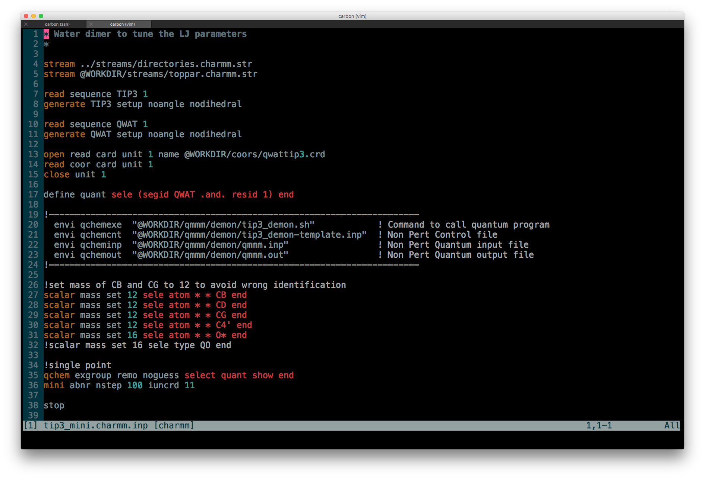

# charmm.vim

Syntax and indent files for [CHARMM](https://www.charmm.org/charmm/).

Based on previous work done by the [CHARMM community](https://www.charmm.org/ubbthreads/ubbthreads.php?ubb=showflat&Number=19038).

Features included so far:

* Syntax highlighting for Charmm
* Filetype detection for `*.charmm.*` files

## Example



## Installation

### Plugin managers

Install with the most common plugin managers including [Vundle](https://github.com/VundleVim/Vundle.vim) and [pathogen.vim](https://github.com/tpope/vim-pathogen).

With Vundle.vim:

1. Add line to `~/.vimrc` file:

  ```viml
  " Vundle
  Plugin 'jonnyjohannes/vim-charmm'
  ```

2. Install Plugins:

  Launch `vim` and run `:PluginInstall`
  
  To install from command line: `vim +PluginInstall +qall`

### Manual installation

Copy the contents of each directory in the respective directories inside `~/.vim`.
